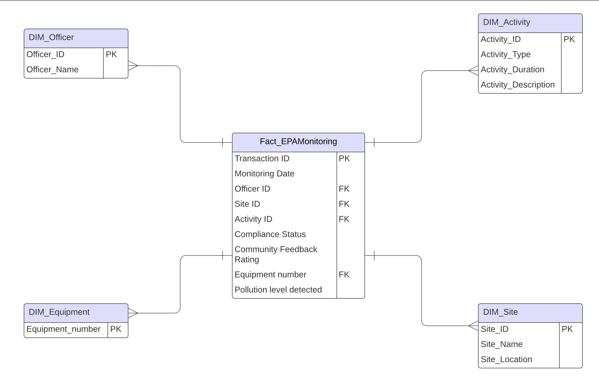
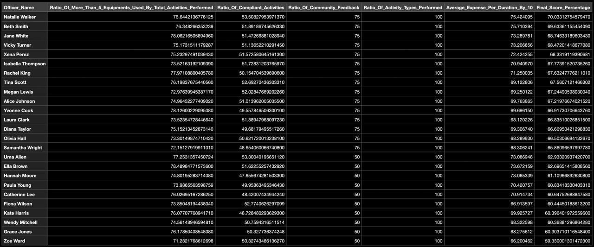

# ECA Best Officer
Design the database and find the best officer for an organization.

## Project Introduction
This project aims to analyze the performance of field officers at the Environmental Protection Agency (EPA) in Newcastle. The objective is to identify the best-performing officer by evaluating various performance metrics, including community engagement, efficiency, and resource management. Based on the findings, the project will propose the implementation of an award incentive program to recognize exceptional contributions in environmental monitoring and motivate all officers to enhance their performance. By employing a systematic approach that involves data modeling, extraction, transformation, and analysis, this project seeks to deliver actionable insights that will not only benefit the agency but also the communities it serves.

## Process
Initially, the dataset we encountered was unmanaged and contained inaccuracies, hindering our ability to evaluate officer performance effectively. To address these challenges, we undertook several steps to mitigate data issues:

1. **Data Modeling:** We implemented data modeling techniques to organize and structure the dataset.
2. **Extraction and Transformation (ETA):** We cleansed and validated the data to ensure accuracy and reliability.
3. **Data Analysis:** We conducted a thorough analysis to identify key performance metrics, enabling us to recognize the best-performing officer.

The ultimate goal is to use these insights to propose an award incentive program, fostering motivation and excellence among all officers in their environmental monitoring efforts.


*Figure 1: Database modelling star schema.*

## Formula for Calculating the Best Officer

The best officer is calculated using a scoring system that evaluates multiple performance metrics, each contributing a weighted percentage to a final score. The formula incorporates various factors derived from a comprehensive dataset about officer activities and their performance.

The `BestOfficer` is calculated using the following formula:

```sql
BestOfficer = (0.05 * ROMT5EUBTP) + (0.30 * ROCA) + (0.25 * ROCF) + (0.05 * ROATP) + (0.35 * AEPDB10)
```

## Officer Performance Metrics

1. **Ratio_Of_More_Than_5_Equipments_Used_By_Total_Activities_Performed (ROMT5EUBTP)**: Measures the individual officer's total number of activities with more than five equipments used relative to the total activities performed by that officer.

2. **Ratio_Of_Compliant_Activities (ROCA)**: Evaluates the percentage of activities conducted by each officer that meet compliance standards compared to their total activities.

3. **Ratio_Of_Community_Feedback (ROCF)**: Represents the average score of community feedback received by the officer, reflecting their effectiveness in community engagement.

4. **Ratio_Of_Activity_Types_Performed (ROATP)**: Measures the diversity of activities carried out by each officer, expressed as a percentage of the total possible activity types.

5. **Average_Expense_Per_Duration_By_10 (AEPRB10)**: Calculates the average expenses incurred by each officer over a defined duration, adjusted by dividing by 10 for easier interpretation.

## Best Officer Based on the Final Score Percentage

*Figure 1: Officers ordered by performance metrics.*